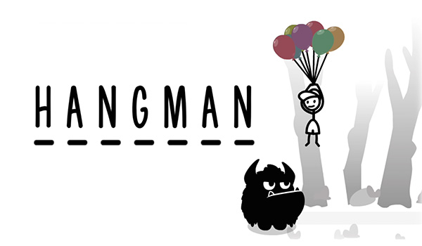
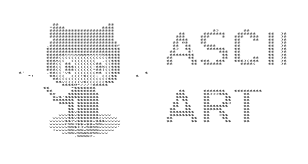
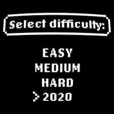

# Hangman game

<!-- [//]: # (![Hang-man]&#40;Hangman_OG-logo.jpg&#41;) -->
 
<!--  -->

### Tasks
Implement a basic hangman game flow. You can use any (even a constant) word to guess, focus on the guessing logic and the termination of the game.

1. The game requires the user to guess all the letters belonging to a word.
2. The initial game state is displayed as _ _ _ _ _ _ _ _ (one underscore for each letter in word).
3. The game state is displayed as _ u _ _ a _ _ if letters 'u' and 'a' are revealed.
4. It is possible to make guesses, and letters that occur in the word are revealed.
5. When a guessed letter does not occur in word, the player loses one life.
6. When a guess is repeated (regardless of its occurrences), the player is notified, and nothing happens.
7. When a guess is wrong (either a new or a repeated letter), the previous wrong letters are shown to the user.
8. The player wins when all letters in word are revealed.
9. The player loses when the number of wrong guesses is higher than the initial value of lives parameter (not counting repeated guesses).
10. When the player types 'quit' as input, the program says good-bye and terminates.

### Case sensitivity
The gameplay is case insensitive, the word display is case sensitive.

1. Both uppercase and lowercase letters are considered valid input.
2. Uppercase and lowercase letter guesses reveal the same letters (e.g. both 'i' and 'I' guesses reveal all the 'i's in the word, regardless of their case).
3. Letters of different cases behave as if they were the same when checking repetitions (e.g. entering c after a C would count as a repetition).
4. On the displaying side, however, letters are revealed as they originally appear in word (e.g. successfully guessing 'i' shows I _ _ i _ a for India).

### Graphics

 
Add ASCII art to visualize lives left.

1. The game state display is accompanied by an ASCII art depending on the number of lives left.
2. The art sequence is adapted to the starting value of the lives parameter (at least between 3 and 7) – this means that the game over art is always the same.

### Load words
The game uses a random word from a pre-defined word collection.

1. The game randomly picks a word at each run.
2. The game randomly picks a country from ***countries*** list.

### Different levels

 
The program allows the user to play on different levels.

1. The game asks the user to pick a difficulty before starting
2. The word-pool and the number of lives depend on the chosen level.

#### Hints
- Store the state of the game (such as the revealed and missed letters) with the help of mutable structures (such as lists or sets).
- Use a set data structure when you have a collection that cannot have duplicate elements.
- Try to create a few (3-6) functions for features that are somewhat separated from the main process (such as dealing with the inputs, parts of the display, or the menu). Think of the input requirements and the results of these units! Add the necessary inputs as parameters, and return the results that is needed by the caller side!
- Ideal team size is 2. Maximum team size is 3.